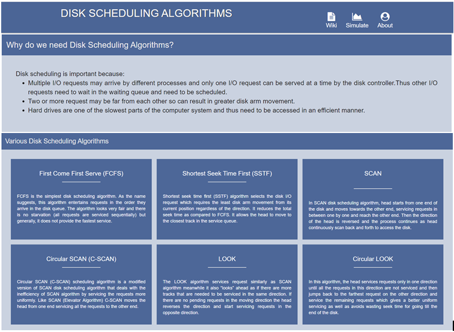
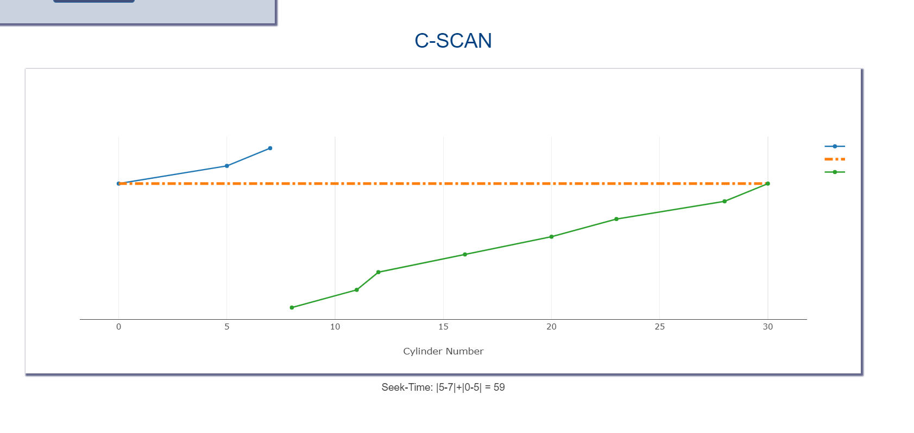
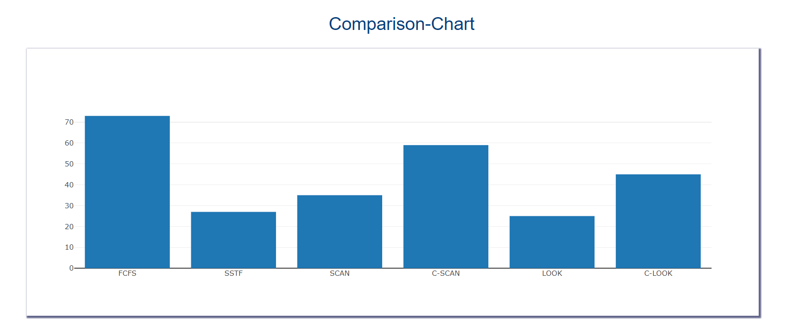

# Disk-Scheduling-Algorithms-Visualization (OS-Project)

### Languages : HTML5, CSS, JS  
### Tools     : Chrome DevTools  
### Libraries : Bootstrap, JQuery, Plotly 
### Link : [Disk Scheduling Visualizer](https://guna74.github.io/Disk-Scheduling/)

## Main Features:  
Information on Disk Scheduling Algorithms, it's need and types i.e. FCFS, SSTF, SCAN, C-SCAN, LOOK, C-LOOK  
Graph using Plotly,  
Comparision Chart using Plotly   

Home Page Screenshot: 

  

Graph Screenshot:

  

Comparision Graph Screenshot:

